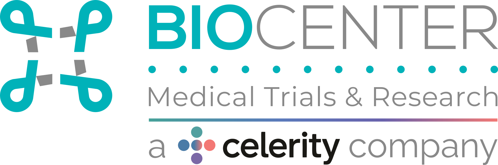

# Guía de estilo — BIOCENTER

Documento de referencia extraído directamente de `css/style.css` (1558 líneas), `index.html`, `estudios.html`, `js/estudios.js` y `js/team.js`. Todos los valores son los que existen hoy en el código, no propuestas. Úsalo para **verificar** que un cambio de UI respeta el sistema existente, no como texto de marketing.

Stack: HTML + CSS plano + Bootstrap 5 (`css/bootstrap.min.css`, `js/bootstrap.min.js`) + Font Awesome (`css/all.min.css`) + Material Symbols (Google Fonts) + jQuery/Fancybox (solo en `estudios.html`, para el lightbox de video) + Swiper (CSS cargado, **sin uso real** — ver sección 9). Sin build step: los archivos se sirven tal cual.

---

## 1. Paleta de colores

### Colores principales (por frecuencia de uso en `style.css`)

| Hex | Nombre semántico | Usos | Dónde aparece |
|---|---|---|---|
| `#f7f9f9` | Blanco hueso / fondo base | 50 | `background-color` de `body` y `header`; color de texto sobre fondos oscuros u oscurecidos (nav_btn, `.pilar_element`, `.carousel-msg`, `.porque_element span`, `.container_contacto_porque a`, `.container_contacto a`, `.footer_row a`, `#button_up span`, iconos de `.container_icons i`) |
| `#5a9c9f` | Teal oscuro (color de acción / marca) | 32 | Fondo y borde de botones (`.container_ensayos_button`, `.btn-primary`, `.btn-outline-primary`, `.btn-active`, `.btn-outline-success`); `#button_up`; color de texto de enlaces sobre fondo claro (`.container_contacto_porque a`, `.container_contacto a`, `.container_biocenter a`); `.swiper-button-next`; paginación activa de `.navegacion_estudios` |
| `#78d5d7` | Teal claro / acento | 14 | `.nav_btn` (fondo), hover de links de nav, `span` dentro de títulos (`BIO` en el h1/h2), `.container_color_cover`, encabezados de sección en mayúsculas (`.ensayos_text h3`, `.diagrama_container p`, `.container_title h3`, `.equipo_subtitle`, `.container_faq h3`), fondo del `span` en `.porque_element`, fondo de `nav` en menú móvil, hover de `.btn_menu` |
| `#373737` | Gris casi negro / texto principal | 12 | Color de texto de párrafos sobre fondo claro (`nav ul li a`, `.biocenter_text`, `.ensayos_text`, `.container_porque`, `.team_card`, `.container_footer`, `.container_rrss`); color de `.nav_btn` y `.modal-btn span` en menú móvil |

### Colores secundarios (uso puntual, 1 vez cada uno — familia de los "pilares")

| Hex | Nombre semántico | Dónde aparece |
|---|---|---|
| `#9ecdce` | Teal claro pastel | Fondo de `.pilar_calidez` |
| `#6dc9cc` | Teal medio-claro | Fondo de `.pilar_profesionalismo` |
| `#6cbabb` | Teal medio | Fondo de `.pilar_etica` |
| `#e0e2e2` | Gris muy claro | `.footer_row a:hover` (color de texto) |

`.pilar_ciencia` reutiliza `#5a9c9f` (color principal), de modo que los 4 "pilares" forman una escala tonal ordenada: `#5a9c9f → #6cbabb → #6dc9cc → #9ecdce`, de más oscuro a más claro.

### Colores en `rgb()/rgba()` (no están en hex, pero son tokens reales del código)

| Valor | Uso |
|---|---|
| `rgb(98, 177, 179)` → `rgba(98, 177, 179, 1)` | Color de partida del degradado de 351° usado en `.container_porque`, `.container_rrss`, `.container_footer` (fondo de estas 3 secciones) |
| `rgba(120, 213, 215, 1)` | Color de llegada del mismo degradado (visualmente equivalente a `#78d5d7`) |
| `rgb(85, 148, 149)` | Color de partida del degradado de `.team_card` (variante ligeramente más oscura que `rgb(98,177,179)`, ver inconsistencia #1 abajo) |
| `rgba(196, 209, 215, 0.3)` | Color estándar de sombra en `text-shadow`/`box-shadow` de botones CTA y títulos grandes (`0px 2px 4px rgba(196, 209, 215, 0.3)`) |
| `rgba(83, 85, 86, 0.3)` | Segundo color de sombra, usado en `container_porque h3`, `container_contacto h3`, `container_rrss h3` (mismo patrón `0px 2px 4px`, color distinto — ver inconsistencia #2) |
| `rgba(49, 140, 192, 0.2)` sobre `rgba(0, 0, 0, 0.5)` | Overlay de la imagen de fondo de `.container_frase` (no forma parte de la paleta de marca, es un tinte fotográfico) |
| `rgba(35, 56, 68, 0.4)` sobre `rgba(0, 0, 0, 0.5)` | Overlay de la imagen de fondo de `.container_contacto` (idem, tinte fotográfico) |

**Regla práctica:** para fondos y texto de marca usar solo `#f7f9f9`, `#5a9c9f`, `#78d5d7`, `#373737`. Para fondos "hero" con degradado (equipo, por qué biocenter, redes sociales, footer) usar el degradado `linear-gradient(351deg, rgba(98,177,179,1) 54%, rgba(120,213,215,1) 100%)` tal cual está definido, sin generar variantes nuevas.

---

## 2. Tipografía

Familia única: **Poppins**, importada vía Google Fonts en la línea 1 de `css/style.css`:

```css
@import url("https://fonts.googleapis.com/css2?family=Poppins:ital,wght@0,100;0,200;0,300;0,400;0,500;0,600;0,700;0,800;0,900;1,100;1,200;1,300;1,400;1,500;1,600;1,700;1,800;1,900&display=swap");
```

El `*` global fija `font-family: "Poppins", sans-serif;` para todo el documento.

Aunque el `@import` carga los 9 pesos (100–900) en normal e itálica, **en `style.css` solo se usan 3 pesos**: `300` (7 veces), `400` (7 veces) y `500` (3 veces). El resto del rango importado no se usa (ver inconsistencia #3).

### Escala real de `font-size` por elemento

| Elemento / clase | Tamaño desktop | Tamaño mobile (≤800px, salvo indicado) | Peso | Mayúsculas |
|---|---|---|---|---|
| `.carousel-msg h1` (título hero) | 60px | 30px | 500 | no (texto ya en mayúsculas en el HTML) |
| `.carousel-msg p` (subtítulo hero) | 30px | 15px | normal | no |
| `.biocenter_text h2` | 40px | — | 300 | no |
| `.container_porque h3` / `.container_contacto h3` (títulos de sección grandes) | 40px | 30px | normal | sí |
| `.biocenter_text h3` | 25px | — | 400 | no |
| `.ensayos_text h3` (título con acento) | 35px | 28px | 400 | sí |
| `.diagrama_container p`, `.container_title h3`, `.equipo_subtitle`, `.container_faq h3` (títulos de sección con color acento) | 35px | — | 400 | sí |
| `.container_rrss h3` | 40px | 32px | normal | sí |
| `.porque_element h4` | 25px | 20px→18px→16px→14px según breakpoint | 400 | sí |
| `.container_contacto_porque p` | 45px | — | normal | no |
| `.container_frase p` (frase destacada) | 35px | 20px→15px | 300 | no |
| `.biocenter_text p`, `.ensayos_text p`, `.container_contacto p` (cuerpo de texto) | 20px | 18px | 300 | no |
| `.porque_element p` | 18px | 15px→12px→10px según breakpoint | 300 | no |
| `nav ul li a` | 14px | — | normal | no |
| `.container_ensayos_button` (botón CTA) | 15px | — | normal | no |
| `.container_contacto a`, `.container_contacto_porque a` (botón CTA grande) | 20px | — | normal | no |
| `.description .cargo` (team card) | 0.85rem | 0.6rem (≤300px) | 300 | sí (heredado de `.description p`) |
| `.description .nombre` (team card) | 1.2rem | 0.7rem (≤300px) | 500 | sí |
| `.pilar_element p` | 20px | 15px (≤380px) | 500 | sí |
| `.pilar_element span` (ícono) | 80px | — | — | — |

**Patrón `text-transform: uppercase`:** se usa consistentemente en títulos de sección con color de acento (`#78d5d7`) y en los rótulos de tarjetas/pilares (`.pilar_element p`, `.porque_element h4`, `.description p`). Los títulos grandes de fondo oscuro (`.container_porque h3`, `.container_rrss h3`, `.container_contacto h3`) también van en mayúsculas aunque su color es `#f7f9f9`, no el acento.

---

## 3. Layout y espaciado

### Contenedor estándar

Todas las secciones principales siguen el mismo patrón: una etiqueta `<section class="nombre_seccion">` de `width: 100%` que envuelve un `<div class="container_nombre_seccion">` centrado con:

```css
max-width: 1600px;
margin: auto;
```

El único contenedor con `padding` lateral explícito es `.container_header` (`padding: 0px 20px`); el resto del contenedor de 1600px no lleva padding lateral propio — el espaciado interno lo dan los elementos hijos (`padding-left: 30px` en `.biocenter_text`, `.ensayos_text`, etc.).

### Patrón `.seccion > .container_seccion`

```html
<section class="biocenter">
  <div class="container_biocenter">
    <div class="biocenter_text">...</div>
    <div class="biocenter_text_img">...</div>
  </div>
</section>
```

Se repite igual en `.pilares/.container_pilares`, `.frase/.container_frase`, `.diagrama/.diagrama_container`, `.ensayos/.container_ensayos`, `.porque/.container_porque`, `.new_team/.container_new_team`, `.faq/.container_faq`, `.contacto/.container_contacto`, `.rrss/.container_rrss`, `footer/.container_footer`.

### Ritmo vertical

- El `header` es `position: fixed`, `height: 100px` (se reduce a `70px` con la clase `.nav_mod` al hacer scroll), por lo que `.cover` compensa con `margin-top: 100px`.
- Los espaciadores entre secciones son informales y varían por sección: `.cover { padding-bottom: 60px }`, `.frase { padding-bottom: 60px }`, `.diagrama { margin-bottom: 60px }`, `.swiper_section { margin-top: 60px; margin-bottom: 60px }`, `.rrss { padding-bottom: 60px (vía .container_rrss) }`. No existe una variable/token de espaciado único: **60px es el valor de separación entre-secciones más repetido** y debería preferirse para nuevas secciones.
- `.container_ensayos` usa `margin-top: 40px` en vez de 60px (inconsistencia menor).

---

## 4. Breakpoints responsive

### `@media` reales en `css/style.css` (grep literal, en orden de aparición en el archivo — no están ordenados de mayor a menor)

| Breakpoint | Línea | Qué ajusta |
|---|---|---|
| `max-width: 900px` | 976 | Footer: `.container_footer`, `.footer_info`, `.footer_links`, `.footer_row`, `.footer_rrss` pasan a layout en columna/centrado |
| `max-width: 1435px` | 1008 | `.container_biocenter` y `.container_ensayos` pasan a `column`; tamaños de `.porque_element` |
| `max-width: 950px` | 1043 | Ancho de `.biocenter_text p` / `.ensayos_text p` a `700px`; escala de `.footer_info img`; tamaños de `.porque_element` |
| `max-width: 900px` (segunda vez, duplicado de breakpoint) | 1085 | Solo `.container_frase p` (tamaño y padding) |
| `max-width: 800px` | 1092 | Breakpoint "mobile" principal: activa menú hamburguesa (`.btn_menu`, `nav` fijo lateral, `.move_nav`), reescribe casi todas las secciones a layout vertical/centrado, activa `.diagrama-movil` y oculta `.diagrama-desktop` |
| `max-width: 300px` | 1320 | Solo `.description .cargo` / `.description .nombre` (tarjetas de equipo muy angostas) |
| `max-width: 430px` | 1336 | `.container_ensayos img`, tamaños de `.porque_element` |
| `max-width: 380px` | 1350 | Tamaños finos de `.container_frase p`, `.pilar_element p`, `.porque_element`, `.footer_info img` |

Nota: `900px` aparece **dos veces** como breakpoint (línea 976 y línea 1085) con reglas distintas y no consecutivas — funcionalmente correcto pero debería consolidarse (ver inconsistencia #4). Los breakpoints no siguen un orden descendente en el archivo (1435 → 950 → 900 → 800 → 300 → 430 → 380), lo que dificulta el mantenimiento.

Además existe un breakpoint **`min-width: 768px`** inyectado dinámicamente desde `js/estudios.js` (ver sección 8) que no vive en `style.css`.

### Breakpoints de JavaScript

- `js/team.js`, línea 128: `let mobileLimit = 790;` — controla el ancho máximo inline (`style="max-width: ..."`) de `.team_card` dentro del carrusel de equipo (`80%` bajo 790px, `90%` en 790px o más).
- `js/team.js`, líneas 235 y 246: `if (window.innerWidth < 992)` — controla cuántos integrantes se muestran por slide del carrusel de equipo: **2 integrantes** por slide bajo 992px, **3 integrantes** por slide en 992px o más. Se evalúa en `DOMContentLoaded` y en cada `resize`.

---

## 5. Componentes

### Header / navegación fija

```html
<header id="header">
  <div class="container_header">
    <div class="logo"><a href="..."></a></div>
    <div class="container_nav">
      <nav id="nav">
        <ul>
          <li><a href="#inicio">Inicio</a></li>
          ...
          <li><a class="nav_btn" href="#contacto">Contacto</a></li>
        </ul>
      </nav>
      <div class="btn_menu" id="btn_menu">
        <span class="material-symbols-outlined">menu</span>
      </div>
    </div>
  </div>
</header>
```

- `header`: `position: fixed`, `height: 100px`, fondo `#f7f9f9`, `z-index: 30`.
- Al hacer scroll (`window.onscroll` en `js/script.js`, umbral `scroll > 20`) se añade la clase `.nav_mod`, que reduce el header a `height: 70px` y añade `box-shadow: 1px 1px 10px 0px #00000010`.
- Menú móvil (≤800px): `.btn_menu` se hace visible (`display: flex`); al hacer clic (`mostrar_menu()` en `js/script.js`) se togglean tres clases: `.move_content` en `#header` y `#container_all` (`right: 200px`, empuja todo el layout) y `.move_nav` en `#nav` (`right: 0`, hace entrar el panel lateral que por defecto está en `right: -250px`). El panel `nav` en móvil tiene fondo `#78d5d7`, ancho `210px`.
- En `resize`, si `window.innerWidth > 800`, se remueven las tres clases automáticamente (evita quedar con el menú abierto al rotar/agrandar).

### `.nav_btn` (botón píldora del nav)

```css
.nav_btn {
  background-color: #78d5d7;
  padding: 10px 30px;
  color: #f7f9f9;
  border-radius: 20px;
  transition: all 300ms;
}
```
En móvil invierte a fondo `#f7f9f9` / texto `#373737`.

### Botones CTA (link-botón)

Patrón repetido en `.container_ensayos_button`, `.container_contacto a`, `.container_contacto_porque a`:

```css
border-radius: 20px;
box-shadow: 0px 2px 4px rgba(196, 209, 215, 0.3);
transition: all 300ms;
```

Ejemplo de markup real:
```html
<a class="container_ensayos_button" href="./estudios.html">Conocer estudios</a>
<a href="./estudios.html">Ver estudios</a>              <!-- dentro de .container_contacto_porque -->
<a href="https://forms.gle/...">Completar formulario</a> <!-- dentro de .container_contacto -->
```
Todos son `<a>`, no `<button>`. El estado hover invierte fondo/borde (fondo sólido → transparente o viceversa), manteniendo el mismo color de borde.

### Botones Bootstrap re-mapeados a la marca

`.btn-primary`, `.btn-outline-primary`, `.btn-outline-success`, `.btn-active` están sobrescritos para usar `#5a9c9f` como color de marca en vez de los azules/verdes por defecto de Bootstrap. `.btn-active` no tiene ningún uso detectado en el HTML/JS actual (clase huérfana, ver inconsistencia #5).

### Tarjetas de equipo `.team_card`

```css
.team_card {
  display: flex;
  flex-direction: column;
  align-items: center;
  padding: 30px;
  background: linear-gradient(351deg, rgb(85, 148, 149) 54%, rgba(120, 213, 215, 1) 100%);
  color: #373737;
  border-radius: 20px;
}
.team_card img { width: 100%; border-radius: 25px; }
.description p { color: #f7f9f9; text-transform: uppercase; text-align: left; }
.description .cargo { font-size: 0.85rem; font-weight: 300; }
.description .nombre { font-size: 1.2rem; font-weight: 500; }
```

Se generan dinámicamente desde `js/team.js` (array `equipo`), markup real por integrante:
```html
<div class="team_card mx-auto" style="max-width: 90%; flex: 1;">
  
  <div class="description">
    <p class="cargo">director ejecutivo</p>
    <p class="nombre">jorge miranda yáñez</p>
    <button type="button" class="btn" data-bs-toggle="modal" data-bs-target="#staticBackdrop1">Saber más</button>
  </div>
</div>
```
El botón "Saber más" abre un modal de Bootstrap con foto, cargo, nombre y descripción larga. `.description .btn` tiene su propio estilo (borde `1px solid #f7f9f9`, `border-radius: 10px`, invierte a fondo `#f7f9f9`/texto `#5a9c9f` en hover).

### Tarjetas de estudios (`estudios.html`, generadas por `js/estudios.js`)

Usan el `.card` de Bootstrap, no una clase propia de marca, salvo el wrapper de imagen y el botón play:
```html
<div class="card h-100 shadow-sm">
  <div class="row g-0 h-100">
    <div class="col-12 col-md-4 position-relative card-img-container">
      <div class="card-img-wrapper">
        
        <button class="btn-play position-absolute" ...>
          <a href="..." data-fancybox>
            <span class="material-symbols-outlined" style="font-size: 3rem; color: white;">play_circle</span>
          </a>
        </button>
      </div>
    </div>
    <div class="col-12 col-md-8">
      <div class="card-body h-100 d-flex flex-column">
        <h5 class="card-title">...</h5>
        <h6 class="card-subtitle mb-2 text-success">...</h6> <!-- o text-danger si no recluta -->
        <div class="card-text flex-grow-1 overflow-auto" style="max-height: 300px;">...</div>
        <a href="..." target="_blank" class="btn btn-outline-primary mt-2">Más información</a>
      </div>
    </div>
  </div>
</div>
```
`.card-img-wrapper`/`.card-study-img`/`.card-img-container` y `.btn-sort`/`.sort-letter` **no viven en `css/style.css`**: se inyectan al final de `js/estudios.js` mediante un `<style>` creado por JS (ver sección 8). El estado (reclutando / cerrado) se comunica solo con `text-success` / `text-danger` de Bootstrap, sin usar la paleta propia de marca.

Filtro y orden (encima del grid de tarjetas):
```html
<select id="filterSelect" class="form-select me-3" style="max-width: 250px;"></select>
<button id="sortBtn" class="btn-sort" title="Ordenar por estado">
  <span class="sort-letter">A</span>
  <span id="sortIcon" class="material-symbols-outlined">arrow_upward</span>
</button>
```
El toggle "Vista: Profesionales/Pacientes" usa un switch tipo iOS con `#28a745` (verde de Bootstrap) para el estado activo — color ajeno a la paleta de marca (ver inconsistencia #6).

Paginación (si se usa `.navegacion_estudios .pagination-lg`) está remapeada a `#5a9c9f` con `border-radius: 20px`, igual criterio que los botones CTA.

### Acordeón FAQ

Usa el `accordion` estándar de Bootstrap sin overrides de color/forma propios; solo se estiliza el título de la sección:
```css
.container_faq h3 {
  font-size: 35px;
  padding: 30px 0px 30px 30px;
  color: #78d5d7;
  text-transform: uppercase;
  font-weight: 400;
}
```
Markup: `.accordion > .accordion-item > .accordion-header/.accordion-button + .accordion-collapse > .accordion-body`, todas clases Bootstrap sin prefijo `bio`/español.

### `.rrss` (redes sociales)

```css
.container_rrss {
  max-width: 1600px; margin: auto;
  background: linear-gradient(351deg, rgba(98,177,179,1) 54%, rgba(120,213,215,1) 100%);
  color: #373737;
  display: flex; flex-direction: column; align-items: center;
  padding-bottom: 60px;
}
.container_icons i { font-size: 5vw; color: #f7f9f9; text-shadow: 0px 2px 4px rgba(83, 85, 86, 0.3); }
.container_icons a:hover i { transform: rotate(15deg) scale(1.2); }
```
```html
<section class="rrss">
  <div class="container_rrss">
    <h3>síguenos en redes</h3>
    <div class="container_icons">
      <a target="_blank" href="https://www.instagram.com/biocentercl/"><i class="fa-brands fa-instagram"></i></a>
      <a><i class="fa-brands fa-facebook"></i></a>
      <a><i class="fa-brands fa-linkedin"></i></a>
    </div>
  </div>
</section>
```
Se repite (misma sección, mismas clases) en el footer como `.footer_rrss .container_icons`, con `i { font-size: clamp(18px, 3vw, 28px) }` en vez de `5vw` puro.

### `.contacto`

Sección con imagen de fondo oscurecida (`background-image: linear-gradient(rgba(35,56,68,0.4), rgba(0,0,0,0.5)), url("../img/contacto.jpg")`), `height: 600px`, texto centrado en `#f7f9f9`, mismo botón CTA píldora que el resto del sitio.

### Footer

```css
.container_footer {
  max-width: 1600px; margin: auto;
  background: linear-gradient(351deg, rgba(98,177,179,1) 54%, rgba(120,213,215,1) 100%);
  color: #373737;
  padding: 40px;
  display: flex; flex-direction: column; gap: 20px;
}
.footer_info { display: flex; justify-content: space-between; align-items: center; gap: 20px; flex-wrap: wrap; }
.footer_links { display: flex; flex-direction: column; gap: 8px; }
.footer_row { display: flex; align-items: center; padding: 10px 0px; }
.footer_row span { margin-right: 12px; font-size: 28px; color: #f7f9f9; }
.footer_row a { color: #f7f9f9; }
.footer_row a:hover { color: #e0e2e2; }
```
```html
<footer>
  <div class="container_footer">
    <div class="footer_info">
      
      <div class="footer_links">
        <div class="footer_row">
          <span class="material-symbols-outlined">location_on</span>
          <a target="_blank" href="https://goo.gl/maps/...">Lincoyán 334, piso 7. Concepción</a>
        </div>
        <div class="footer_row">
          <span class="material-symbols-outlined">mail</span>
          <a href="mailto:contacto@biocenter.cl">contacto@biocenter.cl</a>
        </div>
        <div class="footer_row">
          <span class="material-symbols-outlined">phone_in_talk</span>
          <a href="tel:+56412858421">+56 41 285 8421</a>
        </div>
      </div>
    </div>
    <hr />
    <div class="footer_rrss">...</div>
  </div>
</footer>
```

### `.button_up` (scroll-to-top)

```css
#button_up {
  width: 60px; height: 60px;
  background-color: #5a9c9f;
  border-radius: 50%;
  position: fixed; bottom: 50px; right: 50px; z-index: 20;
  cursor: pointer;
  border: solid 4px transparent;
  transition: all 300ms ease;
  transform: scale(0);
}
#button_up:hover { transform: scale(1.1); border-color: rgba(0,0,0,0.1); }
#button_up span { color: #f7f9f9; font-size: 35px; }
```
```html
<div id="button_up" class="button_up">
  <span class="material-symbols-outlined">expand_less</span>
</div>
```
Nota: el selector CSS usa `#button_up` (ID) pero el HTML también trae la clase `.button_up`, que no está definida en `style.css` (redundante/clase muerta, ver inconsistencia #7). Visibilidad controlada por scroll en `js/script.js` (`scroll(px) > 100` → aparece, `< 500` → desaparece — rango con solapamiento entre 100 y 500, revisar si es intencional).

---

## 6. Iconografía

Dos sistemas de íconos, con criterio de uso claro y consistente en todo el sitio:

- **Material Symbols Outlined** (`<span class="material-symbols-outlined">nombre</span>`) — para **iconografía de interfaz**: menú hamburguesa (`menu`), pilares (`science`, `balance`, `workspace_premium`, `favorite`), bloque "por qué Biocenter" (`language`, `volunteer_activism`, `emergency`, `transfer_within_a_station`), scroll-to-top (`expand_less`), datos de contacto en footer (`location_on`, `mail`, `phone_in_talk`), botón play de video (`play_circle`), orden de tarjetas de estudios (`arrow_upward`/`arrow_downward`), fases del FAQ (`accessibility_new`, `diversity_3`, `reduce_capacity`, `stethoscope_check`). Se carga vía `<link>` a Google Fonts con parámetros fijos `opsz,wght,FILL,GRAD@48,400,0,0`.
- **Font Awesome** (`<i class="fa-brands fa-instagram"></i>`) — reservado exclusivamente para **logos de redes sociales** (Instagram, Facebook, LinkedIn; Twitter/TikTok están comentados en el HTML, no eliminados). Se usa siempre dentro de `.container_icons a > i`.

Regla de uso: nunca mezclar ambos sistemas para el mismo tipo de ícono. Si el ícono representa una marca externa (red social), usar Font Awesome (`fa-brands`); para cualquier otro ícono de interfaz, usar Material Symbols Outlined.

---

## 7. Convenciones de código

- **Nomenclatura de clases en español, `snake_case`**: `container_header`, `container_all`, `footer_row`, `footer_links`, `pilar_element`, `pilar_ciencia`, `biocenter_text`, `container_contacto_porque`, `equipo_subtitle`, `container_new_team`. No se usa BEM ni camelCase para clases propias.
- **Mezcla deliberada con utilidades de Bootstrap 5**: es normal encontrar clases propias combinadas con utilidades de Bootstrap en el mismo elemento, p. ej. `class="carousel slide position-relative mx-auto"`, `class="col-md-6 mb-4"`, `class="ensayos_text mb-5"`, `class="team_card mx-auto"`. Las utilidades de Bootstrap (`mb-3`, `mx-auto`, `d-flex`, `col-12 col-md-4`, etc.) se usan para *spacing* y *grid*; las clases propias en español llevan el estilo visual de marca (color, tipografía, layout de sección).
- **IDs en inglés/genérico** (`header`, `nav`, `btn_menu`, `container_all`, `button_up`, `card-container`, `filterSelect`, `sortBtn`) mientras las **clases de contenido** están en español — patrón consistente en todo el código.
- **Idioma del contenido**: español, `<html lang="es">` en ambas páginas (`index.html`, `estudios.html`). Todo el texto visible, alt text y aria-label están en español.
- Los estilos "vivos" no están solo en `style.css`: `js/estudios.js` inyecta dos bloques `<style>` completos en runtime (toggle de vista y tarjetas de estudio). Cualquier auditoría de estilos debe revisar también ese archivo, no asumir que `style.css` es la única fuente.

---

## 8. Estilos inyectados dinámicamente (`js/estudios.js`)

Al final de `js/estudios.js` se crean dos elementos `<style>` que se anexan a `<head>` en runtime, fuera de `style.css`:

1. **Toggle de vista** (`inicializarBotonesVista()`): clases `.toggle-view-container`, `.toggle-view-text`, `.switch`, `.slider`, `.slider.round`. Usa `#ccc` (gris Bootstrap-like) como fondo inactivo y **`#28a745`** (verde Bootstrap) como color de estado activo — no reutiliza `#5a9c9f`/`#78d5d7` de la marca.
2. **Tarjetas de estudio responsivas**: `.card-img-container`, `.card-img-wrapper` (`height: 200px`, `overflow: hidden`), `.card-study-img` (`object-fit: cover`), con un breakpoint propio `@media (min-width: 768px)` que cambia el wrapper a `position: absolute` de altura completa. También define `.btn-sort` (`color: #495057`, hover `background-color: #f0f0f0; color: #212529`) y `.sort-letter` — estos grises (`#495057`, `#f0f0f0`, `#212529`) tampoco pertenecen a la paleta de marca.

---

## 9. Reglas al añadir nueva UI

1. **Reutiliza los tokens existentes**: `#f7f9f9`, `#5a9c9f`, `#78d5d7`, `#373737` para cualquier elemento nuevo. Si necesitas un fondo tipo "hero" o tarjeta con degradado, usa exactamente `linear-gradient(351deg, rgba(98,177,179,1) 54%, rgba(120,213,215,1) 100%)` (o su variante de `.team_card`), no generes un degradado nuevo.
2. **No introduzcas colores nuevos**, ni siquiera "casi iguales" a los existentes (ver inconsistencias #1 y #6 abajo — ese patrón ya generó deuda que no conviene repetir).
3. **Sigue el patrón `<section class="nombre">` > `<div class="container_nombre">`** con `max-width: 1600px; margin: auto;` para cualquier sección nueva de página completa.
4. **No agregues una nueva familia tipográfica** ni pesos fuera de 300/400/500 salvo que se justifique y se documente aquí; Poppins ya cubre el rango necesario.
5. **Usa `text-transform: uppercase`** para títulos de sección (siguiendo el patrón de `#78d5d7` + `uppercase` + peso 400) y para etiquetas cortas tipo pill/cargo (peso 500 uppercase).
6. **Prefiere Material Symbols Outlined** para cualquier ícono de interfaz nuevo; reserva Font Awesome solo para logos de redes sociales adicionales.
7. **Botones/CTA nuevos**: `border-radius: 20px` y `box-shadow: 0px 2px 4px rgba(196, 209, 215, 0.3)`, con inversión de fondo/borde en `:hover` (no cambies el radio ni la sombra por otros valores).
8. **Mantén todo el contenido visible en español**, clases propias en `snake_case` español, IDs y utilidades de layout pueden seguir en inglés/Bootstrap.
9. **Breakpoints**: si necesitas uno nuevo, ubícalo en `css/style.css` cerca de los existentes y evita duplicar un `max-width` ya usado (hoy `900px` está duplicado, no repitas el patrón). Si el componente es JS-driven (como el carrusel de equipo), documenta el breakpoint numérico en el propio JS como ya hacen `team.js` (790px/992px).
10. **No agregues estilos inline** para reglas reutilizables; si un componente ya tiene un patrón (tarjeta, botón, ícono circular), créalo como clase en `style.css`, no repitas `style="..."` como hace parcialmente `js/estudios.js`.

---

## 10. Inconsistencias detectadas en el CSS actual

1. **Verdes-teal casi duplicados en los degradados de fondo**: `.container_porque`, `.container_rrss`, `.container_footer` usan `rgb(98, 177, 179)` como color de partida del degradado, pero `.team_card` usa `rgb(85, 148, 149)` — un tono ligeramente más oscuro y distinto de `#5a9c9f` (`rgb(90, 156, 159)`). Son 3 tonos de teal oscuro casi indistinguibles (`#5a9c9f`, `rgb(98,177,179)`, `rgb(85,148,149)`) sin que quede claro cuál es la fuente de verdad.
2. **Dos colores de sombra de texto/caja intercambiados sin criterio aparente**: `rgba(196, 209, 215, 0.3)` (usado en `carousel-msg h1`, `container_frase p`, botones CTA, `container_contacto p`) vs. `rgba(83, 85, 86, 0.3)` (usado en `container_porque h3`, `container_contacto h3`, `container_rrss h3`, `container_icons i`). Ambos con el mismo patrón `0px 2px 4px`, pero ninguno documentado como el "oficial".
3. **Poppins se importa con 18 combinaciones de peso/estilo (100–900, normal e itálica)** pero `style.css` solo usa los pesos `300`, `400` y `500` en normal. El resto es peso muerto de carga (afecta performance sin beneficio visual).
4. **Breakpoint `900px` duplicado**: aparece dos veces en `style.css` (línea 976 para el footer, línea 1085 solo para `.container_frase p`), en vez de consolidarse en un único bloque `@media (max-width: 900px)`.
5. **Clases CSS huérfanas** (definidas en `style.css` pero sin ningún uso detectado en `index.html`/`estudios.html`/JS): `.btn-active`, toda la familia `.swiper*` (Swiper.js nunca se carga ni se usa; el carrusel de equipo usa el carrusel nativo de Bootstrap), `.spinner-wrapper`/`.spinner-border`/`@keyframes spin` (loader comentado en el HTML), `.diagrama-movil`/`.diagrama-desktop` sí se usan pero solo se activan en el breakpoint de 800px.
6. **`#button_up` vs `.button_up`**: el HTML aplica ambos selectores al mismo `<div>`, pero el CSS solo define reglas para el ID `#button_up`; la clase `.button_up` no tiene ninguna regla asociada — probablemente vestigio de una refactorización.
7. **Colores fuera de la paleta de marca en componentes inyectados por JS**: el toggle "Vista" en `estudios.js` usa verde de Bootstrap `#28a745` (en vez de `#5a9c9f`), y `.btn-sort` usa grises Bootstrap (`#495057`, `#f0f0f0`, `#212529`, `#ccc`) que no aparecen en ningún otro lugar del sitio.
8. **Rango de scroll con solapamiento en `#button_up`**: en `js/script.js`, el botón aparece si `scroll > 100` y desaparece si `scroll < 500`; entre 100 y 500 ambas condiciones son simultáneamente relevantes según el orden de evaluación, lo que en la práctica funciona pero no expresa una intención clara de "aparece después de X, desaparece antes de volver arriba".
9. **Buen uso, sin inconsistencia, pero a vigilar**: la escala tipográfica de títulos de sección con acento (35px, peso 400, uppercase, color `#78d5d7`) está duplicada literalmente en 5 reglas CSS distintas (`.ensayos_text h3`, `.diagrama_container p`, `.container_title h3`, `.equipo_subtitle`, `.container_faq h3`) en vez de una sola clase utilitaria reutilizada — no rompe nada hoy, pero cualquier cambio de esta escala requiere editar 5 lugares a mano.

---

## 11. Componentes de sucursal (portada selectora y header)

Añadidos con la versión de doble sucursal. Viven al final de `css/style.css`, bajo el
comentario `SUCURSALES (SEDES)`, y **no introducen ningún color, fuente ni sombra nueva**:
reutilizan los tokens de las secciones 1 y 2.

### 11.1 `.sede_badge` — distintivo de sucursal en el header

Píldora junto al logo en las cuatro páginas de sucursal. Indica en qué sede estás y
enlaza a `index.html` para cambiar.

```html
<div class="logo">
  <a href="./concepcion.html"></a>
  <a class="sede_badge" href="./index.html" title="Cambiar de sucursal">
    <span class="material-symbols-outlined">location_on</span>
    <span data-sede-nombre>Concepción</span>
    <span class="material-symbols-outlined sede_badge_caret">unfold_more</span>
  </a>
</div>
```

| Propiedad | Valor | Token de origen |
|---|---|---|
| `background-color` | `#f7f9f9` | fondo base |
| `border` | `solid 1px #9ecdce` | secundario pastel |
| `color` | `#5a9c9f` | teal oscuro |
| `border-radius` | `20px` | radio de píldora (igual que `.nav_btn`) |
| `font-size` / `font-weight` | `13px` / `500` | escala de nav |
| hover | fondo `#78d5d7`, texto `#f7f9f9` | acento |

A ≤800px se oculta el texto y el caret: queda solo el icono, para no competir con el
botón de menú móvil.

### 11.2 Portada selectora (`index.html`)

Página sin header ni footer del sitio. Fondo: el **degradado de 351°** de la sección 1,
aplicado a `.linktree_body`. Sobre él, el logo vertical blanco
(`./img/logos/logo-vertical-blanco.png`) y una rejilla de tarjetas.

| Clase | Rol | Notas |
|---|---|---|
| `.container_linktree` | Contenedor | `max-width: 1600px`, igual que el resto del sitio |
| `.sede_card` | Tarjeta de sucursal | fondo `#f7f9f9`, `border-radius: 25px` (igual que `.team_card`), sombra `0px 2px 4px rgba(83,85,86,.3)`, `flex: 1 1 380px` |
| `.sede_card_head h2` | Nombre de la sucursal | `35px` / `400` / uppercase / `#5a9c9f` — misma escala que los títulos de sección |
| `.sede_card_cta` | Botón principal | fondo `#5a9c9f`, `border-radius: 20px`, sombra `0px 2px 4px rgba(196,209,215,.3)`; hover a `#78d5d7` + texto `#373737`, idéntico al patrón de CTA de la sección 5 |
| `.sede_card_link` | Botón secundario | mismo radio, borde `1px #9ecdce`, sin relleno |
| `.sede_card_acciones` | Accesos rápidos | teléfono, correo y mapa; iconos Material Symbols a `28px` en `#5a9c9f`; a ≤430px pasan de columna a fila |

El HTML de estas tarjetas **no está en `index.html`**: lo genera `js/linktree.js` a partir
de `SEDES` (`js/data/sedes.js`). Añadir una tercera sucursal al objeto la hace aparecer
aquí sin tocar CSS ni HTML.

### 11.3 Estados vacíos

Para una sucursal cuyos datos aún no se han cargado:

- `.equipo_vacio` — sustituye al carrusel de equipo. Icono `groups` a `70px` en `#78d5d7`
  y un párrafo de `18px` centrado, máximo `700px` de ancho.
- El mensaje de "sin estudios" reutiliza el `.alert .alert-info` de Bootstrap que ya
  usaba la página de estudios para el filtro sin resultados.

### 11.4 `.estudios_sede_hint`

Línea bajo el título de la página de estudios que nombra la sucursal.
`18px`, uppercase, `letter-spacing: 1px`, `#5a9c9f`.
